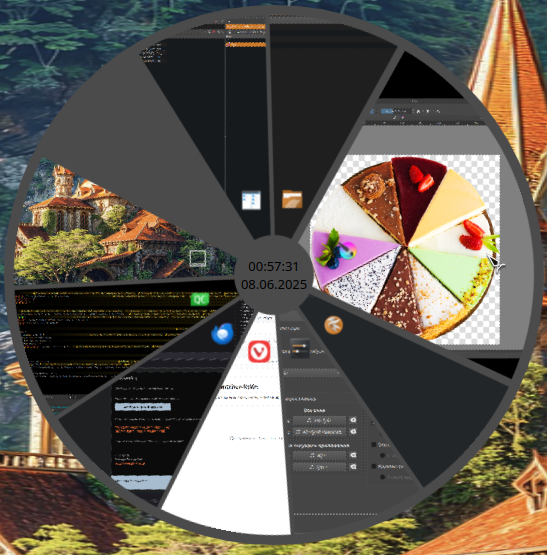

# PieTabSwitcher-KWin

Windows switch in the form of circle sectors for KWin (KDE Plasma6)




# For dev

Sources and run:
```
cd ~/.local/share/kwin/tabbox/pie/
plasmashell --replace
```
or `kwin_x11 --replace` or `kwin_wayland --replace` but they will kill all apps in user session. plasmashell just reloads plasma, not full DE session.
